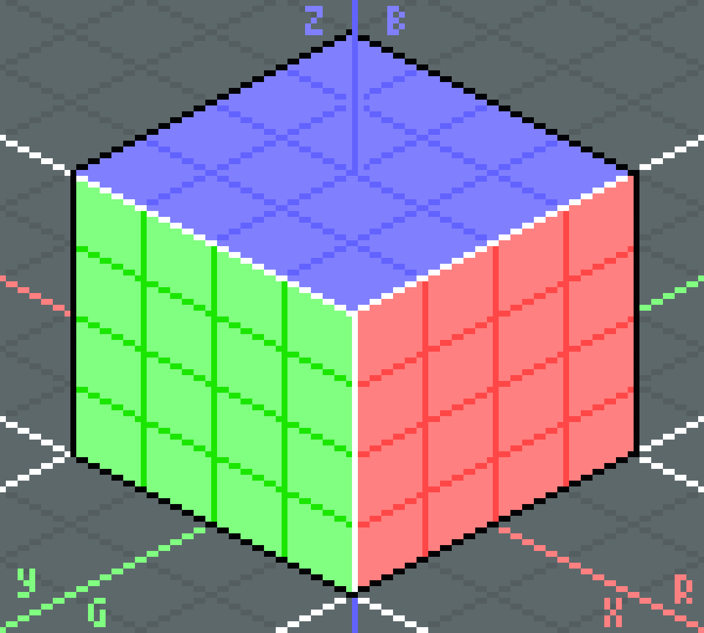
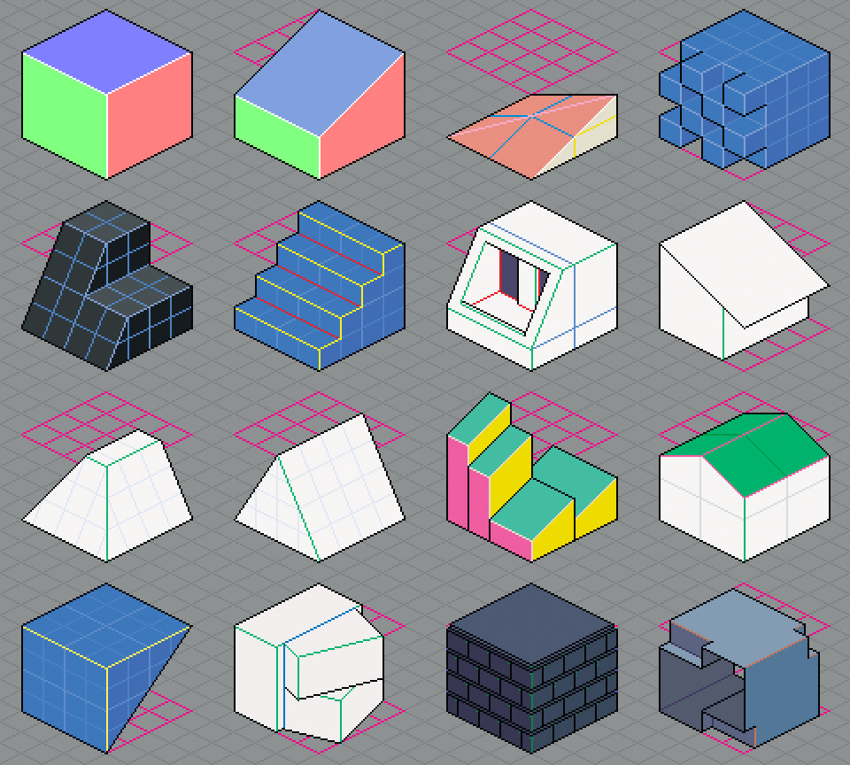

# TiliX Cube

The base cube has a size of 4 × 4 × 4 cells.

> Note: X-axis is red, Y-axis is green, and Z-axis is blue.

A wide variation of building cubes can be created. Because the grid size has been chosen carefully, you'll see that many lines end up exactly where we want them to be.

> Remember: Always try to start and end lines on [Right Pixels](dual-and-right-pixels.md).
