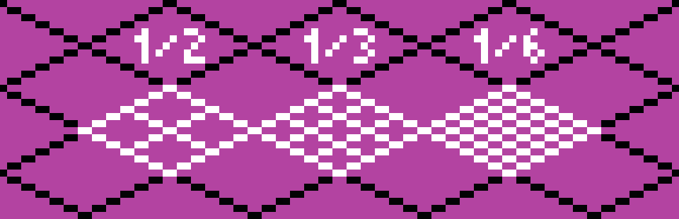

# TiliX Grid

### Grid Cell
The cell size is an isometric square, 7 × 7 dual pixels (26 × 13 px).

A cell can be divided by 2, 3 and 6. This makes it very flexible.

### Grid Block
A grid block is 4 × 4 cells, (98 × 49 px).

The block size has been carefully chosen. It works well because it can be divided into 4 × 4 cells (see above). It also can be divided by 3 (and 6). This makes it very flexible.

