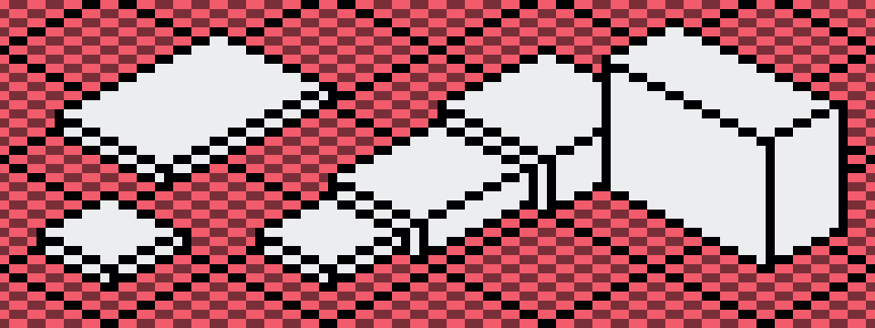
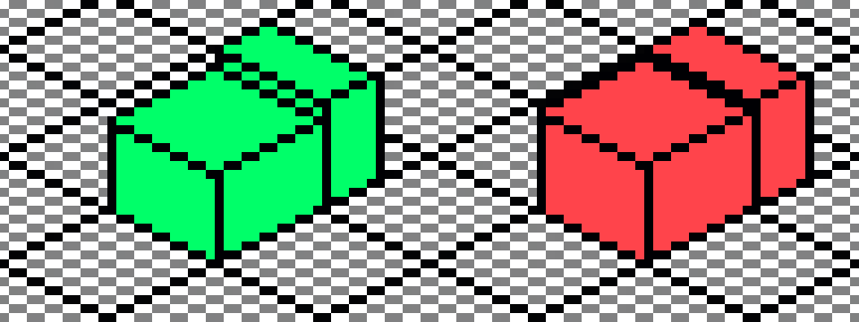

# ISO Lines

Draw ISO lines on top of the grid lines. Avoid the spaces in between the grid lines. This will ensure that iso lines won't add up to a width of 2 pixels when combining modular objects.

_Above all objects have a height in sync with the grid lines._

_The object on the left is in sync with the iso grid. The right object is out of sync with the grid. The top lines show ugly heights of 2 pixels._

> Note: Limiting iso lines to the grid lines reduces the available height options for objects. But it helps avoiding cluttered lines.

> Note: A downside to this approach is that objects cannot be vertically mirrored. The vertical lines would end up on the left side of dual pixels.
