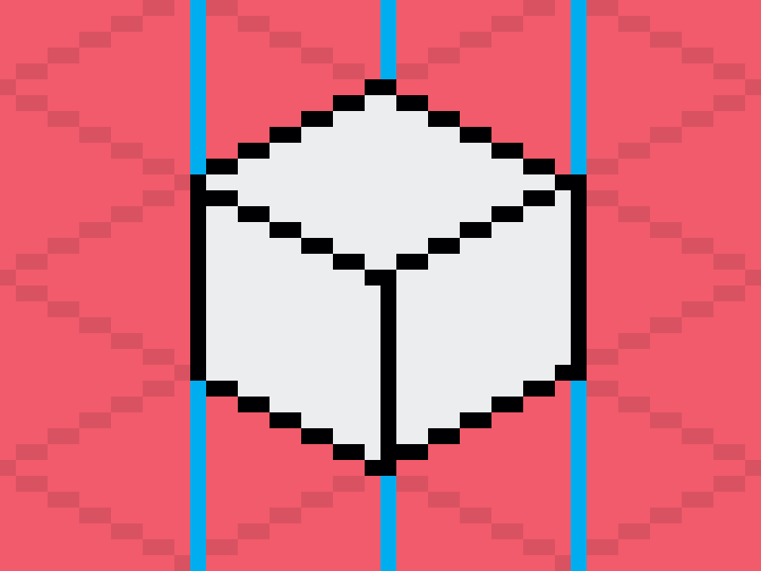
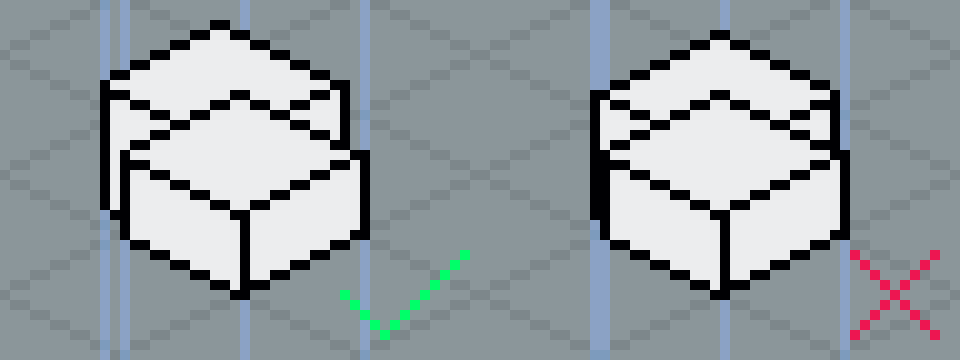

# Vertical Lines
Always draw vertical lines on the right side of dual pixels. This will ensure that vertical lines won't add up to a width of 2 pixels when combining modular objects.

> Note: The downside to this approach is that objects cannot be vertically mirrored. The vertical lines would end up on the left side of dual pixels.
